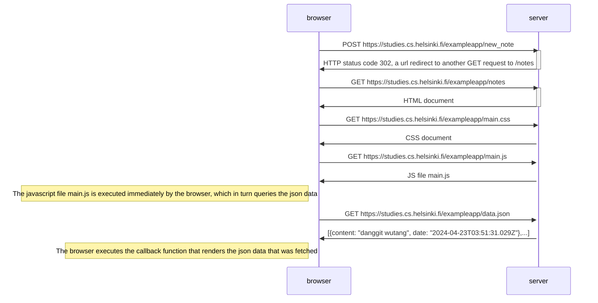

```mermaid
	sequenceDiagram
		participant browser
		participant server
		browser->>server: POST https://studies.cs.helsinki.fi/exampleapp/new_note
		activate server 
		server->>browser: HTTP status code 302, a url redirect to another GET request to /notes
		deactivate server 
		browser->>server: GET https://studies.cs.helsinki.fi/exampleapp/notes
		activate server 
		server->>browser: HTML document
		deactivate server 
		browser->>server: GET https://studies.cs.helsinki.fi/exampleapp/main.css
		activate server
		server->>browser: CSS document
		browser->>server: GET https://studies.cs.helsinki.fi/exampleapp/main.js
		activate server
		server->>browser: JS file main.js

		Note left of browser: The javascript file main.js is executed immediately by the browser, which in turn queries the json data

		browser->>server: GET https://studies.cs.helsinki.fi/exampleapp/data.json
		activate server
		server->>browser: [{content: "danggit wutang", date: "2024-04-23T03:51:31.029Z"},...]

		Note left of browser: The browser executes the callback function that renders the json data that was fetched
```	
