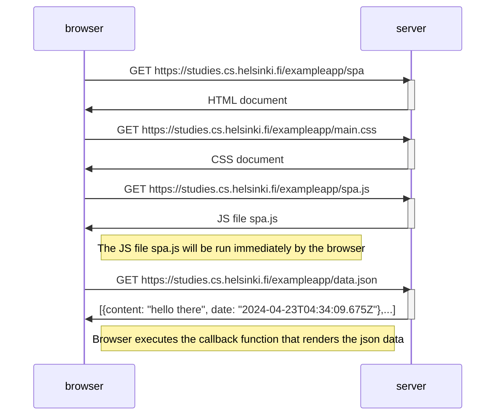

```mermaid
sequenceDiagram 
participant browser
participant server
browser->>server: GET https://studies.cs.helsinki.fi/exampleapp/spa
activate server
server->>browser: HTML document 
deactivate server
browser->>server: GET https://studies.cs.helsinki.fi/exampleapp/main.css
activate server
server->>browser: CSS document
deactivate server
browser->>server: GET https://studies.cs.helsinki.fi/exampleapp/spa.js
activate server
server->>browser: JS file spa.js
deactivate server

Note right of browser: The JS file spa.js will be run immediately by the browser

browser->>server: GET https://studies.cs.helsinki.fi/exampleapp/data.json 
activate server
server->>browser: [{content: "hello there", date: "2024-04-23T04:34:09.675Z"},...]
deactivate server
Note right of browser: Browser executes the callback function that renders the json data 
 
```
